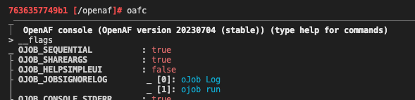

# Tmux UTF-8 support

When using OpenAF console or other OpenAF based scripts that make use of the ANSI character set you might see the wrong mapping occurring within **Tmux**:



This occurs because **Tmux** is not "aware" that UTF-8 can be used so you need to start it with "UTF-8 mode" enable:

```bash
tmux -u
```

And then the correct mapping will occur:


See more in [https://github.com/tmux/tmux/wiki/FAQ#how-do-i-use-utf-8](https://github.com/tmux/tmux/wiki/FAQ#how-do-i-use-utf-8).