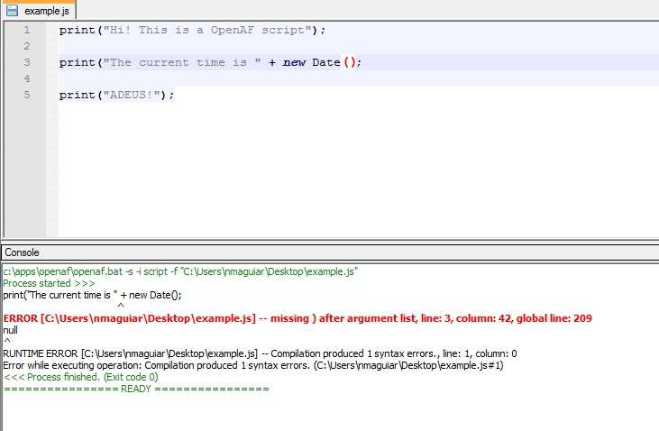

# How to use OpenAF from Notepad++

It's possible to use Notepad++ to run and debug OpenAF scripts. To set it up just follow the steps:

1. Download and install (if don't have) the NPPExec plugin for Notepad++

````javascript
set hglt1 = ERROR [%ABSFILE%] -- *, line: %LINE%, column: %CHAR%
c:\apps\openaf\openaf.bat -s -i script -f "$(FULL_CURRENT_PATH)"
````

2. Inside Notepad++ go to menu: Plugins -> NPPExec -> Execute…

    1. Enter a similar command (correcting to your OpenAF script path):
    ````bash
    set hglt1 = ERROR [%ABSFILE%] -- *, line: %LINE%, column: %CHAR%
    c:\apps\openaf\openaf.bat -s -i script -f "$(FULL_CURRENT_PATH)"
    ````
    2. You can save it as OpenAF.

3. Inside Notepad++ go to menu: Plugins → NPPExec → Console Output Filters&#46;&#46;&#46;

    1. In the HighLight tab, select the first mask and enter the following text:
    ````bash
    $(hglt1)
    ````
    2. Enter FF on the Red component
    3. Check the [B]old checkbox

_Mask strings are limited to a few characters in NPP, hence the need to set the *$(hglt1)* variable on execution._

Now to execute you can hit Ctrl-F6 (to execute immediately) or F6 (to edit the command):

