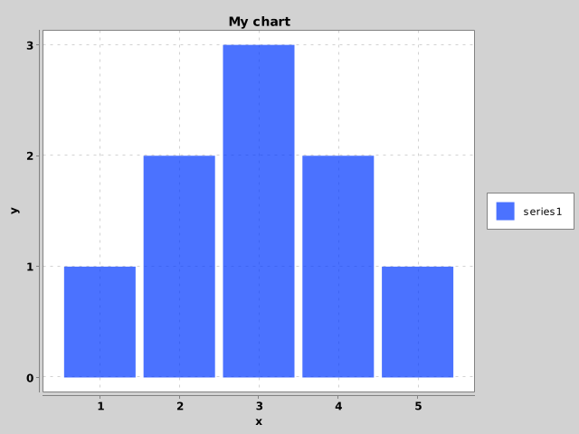

# Using Java classes & methods

Since OpenAF is Java-based it's easy to load and instantiate Java classes from external JAR files.

As an example, let's try to use XChart library. To start, create a "lib" folder and download, from Maven, the [latest version of the XChart library](https://repo1.maven.org/maven2/org/knowm/xchart/xchart/3.8.1/xchart-3.8.1.jar).

> Is this example we are using just one JAR file but you can have multiple JAR files on the lib folder and all will be considered.

## Loading JARs dynamically

Then, on an OpenAF script or on the OpenAF console, execute the following code to dynamically load the downloaded jar (or jars) on the "lib" folder:

````javascript
loadExternalJars("lib")
````

## Instantiating Java classes

After dynamically loading the jars on the "lib" folder the corresponding included classes are ready to be used.

Let's start by creating a new instance of the CategoryChartBuilder class:

````javascript
var chartBuilder = new Packages.org.knowm.xchart.CategoryChartBuilder()
````

## Using Java class instances

Now you can use the created instance directly. Do note that "My chart", as other values, are automatically converted to the Java correspondent types (in this case java.lang.String)

````javascript
chartBuilder = chartBuilder.width(640).height(480).title("My chart")
````

You can also use other Java values as arguments for Java methods. Do note that when refering to the default "java"/"javax" packages there is no need to prefix with "Packages.".

````javascript
var chart = chartBuilder.xAxisTitle("x").yAxisTitle(new java.lang.String("y")).build()
````

## Mixing Javascript with Java

You can easily use javascript mixed with Java. Let's create a map with information for a chart series:

````javascript
var data = { name: "series1", x: [ 1, 2, 3, 4, 5 ], y: [ 1, 2, 3, 2, 1 ] } 
````

And then use it with the Java methods from XChart. Note that _java.util.List_ and _java.util.Map_ can be converted directly from a javascript array and map correspondently.

````javascript
chart.addSeries(data.name, data.x, data.y)
````

Now let's generate the chart image from XChart:

````javascript
Packages.org.knowm.xchart.BitmapEncoder.saveBitmap(chart, "mychart.png", Packages.org.knowm.xchart.BitmapEncoder.BitmapFormat.PNG)
````

The result will be:


