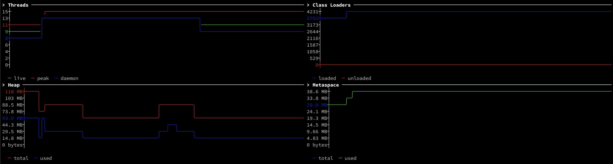

# oafp to build grids

List of examples of use of oafp to build grids:

### Grid with Java's threads, class loaders, heap and metaspace from a Java's hsperf file

```bash
oafp /tmp/hsperfdata_user/12345 in=hsperf path=java out=grid grid="[[(title:Threads,type:chart,obj:'int threads.live:green:live threads.livePeak:red:peak threads.daemon:blue:daemon -min:0')|(title:Class Loaders,type:chart,obj:'int cls.loadedClasses:blue:loaded cls.unloadedClasses:red:unloaded')]|[(title:Heap,type:chart,obj:'bytes __mem.total:red:total __mem.used:blue:used -min:0')|(title:Metaspace,type:chart,obj:'bytes __mem.metaTotal:blue:total __mem.metaUsed:green:used -min:0')]]" loop=1
```

Result:
