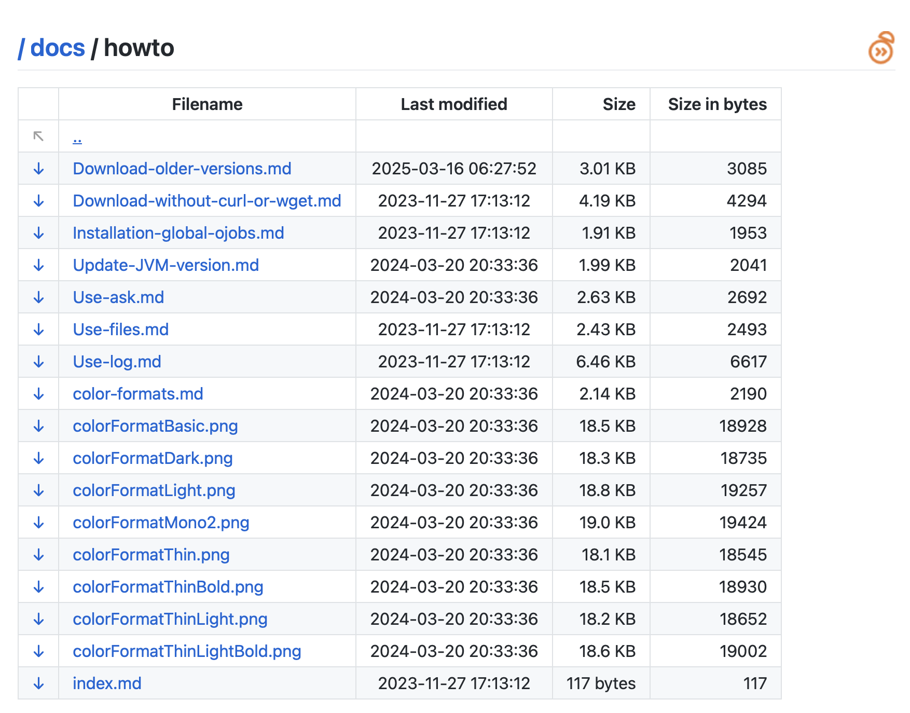
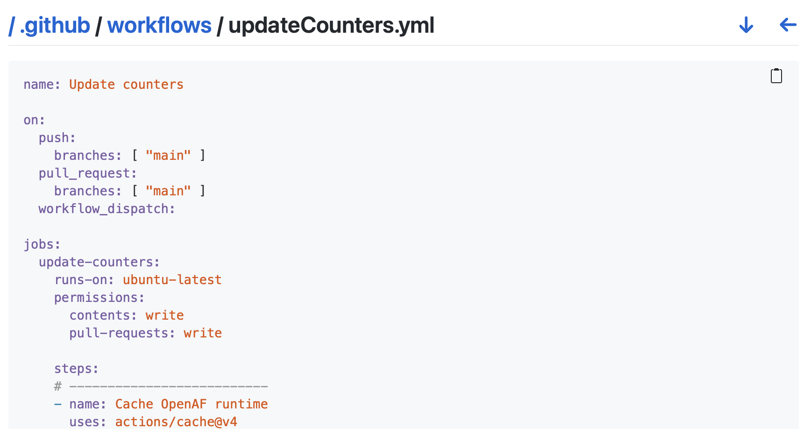

# Common browse functionality

Starting on oJob-common oPack version 20250415 it's possible to use the common browse functionality to list the contents of a directory or a file. This functionality is generic enough to be applied to different scenarios like: browsing a local filesystem; browsing an object storage bucket; browsing an AWS ECR; browsing a Maven repository; etc.

> To install oJob-common either refer to it on an oJob (ojob > opacks > oJob-common) or install it directly by executing ``opack install ojob-common````

There are different implementations and more can be built following similar options. Here are some examples.

## Browse a local filesystem

The easiest way to try this one is to just execute:

```yaml
ojob ojob.io/httpServers/EasyHTTPd port=8888 path=.
```

The if you open your browser on port 8888 (e.g. http://localhost:8888) you will get an interface similar to this one:



On this interface you can use the left arrow to download the corresponding file or, clicking on the filename, you will be able to see directly the content of the file (e.g. .html, .md (automatically rendered), .xml, .json (automatically rendered)) or a page with the content of the file (e.g. .js, .sh, .yaml, etc.):



Here the interface allows you to go back using breadcrumbs or download the file (down arrow) or go back (left arrow). You can also copy+paste the contents clicking on the clipboard icon.

### How do I setup an oJob to browse a local filesystem?

Let's see an example and the available options. Start by creating a file called `myFileBrowser.yaml` with the following content:

```yaml
ojob:
  daemon: true   # we want to run it as a daemon 
  opacks: 
  - oJob-common  # we want to install/include oJob-common

include:
- oJobBrowse.yaml  # we want to add the oJob common browse functionality

todo:
# First, let's start the web server
- (httpdStart): 8888
  ((mapList )): true   # we want to include common javascript, css and fonts embeeded in OpenAF

# Second, we want anyone landing on / to be redirected to /browse
- (httpdRedirect): 8888
  ((uri        )): /
  ((targetURI  )): /browse

# Third, we want to include the common browse functionality in /browse
- (httpdBrowse): 8888
  ((uri      )): /browse
  ((path     )): ..
```

That's it. Now execute: 

```bash
ojob myFileBrowser.yaml
```

and browse to http://localhost:8888/browse. You will see the contents of the folder where you executed the command.
You can also use the `path` argument to point to a specific folder.

**Arguments available generically for (httpdBrose)**

| Argument | Type | Description |
|--------|----|-------------|
| uri | String | The URI where the browse functionality will be available. |
| path | String | The path to the folder you want to browse. If not specified, it will use the current working directory. |
| options | Map | A map with options to be passed to the browse functionality depending on implementation. |
| fns | Map | When extending beyond the default local filesystem browsing functionality this is a list of functions to be used. |

**Options available for (httpdBrowse) if implemented**

| Option | Type | Description |
|--------|-----|---------|
| browse | Boolean | If true, the browse functionality will be available. Otherwise direct file access will be available. |
| default | String | The default file to open if it exists on a folder instead of listing the contents (e.g. README.md) |
| showURI | Boolean | If true, the URI (e.g. /browse) of the file will be shown on the interface otherwise it will be hidden. |
| logo | String | The logo URL to be shown on the interface. If not specified, the default OpenAF logo will be used. |
| footer | String | The footer text (in markdown) to be shown on the interface. If not specified, the default OpenAF footer will be used. |
| sortTab | Boolean | Include hover buttons to sort the table by column. |

## Other implementations

* [Browse an AWS S3 bucket](common-browse-s3.md)
* [Browse an AWS ECR](common-browse-ecr.md)

## Implementing a custom browse functionality

If you want to implement a custom browse functionality, you can do it by implementing `fns` functions. Currently there are 6 functions that you might need to rewrite (you don't define them the default ones will be used). The default login to call them is:

```js
var output
var list = getList(request, options)
if (list.isList) {
    output = renderList(list, server, request, options)
} else {
    if (list.isFile) {
        var obj = getObj(request, options)
        output = renderObj(obj, server, request, options)
    } else {
        output = renderEmpty(request, options)
    }
}
```

Functions description:

**"init" function**

```js
init()
```

The *init* function doesn't take any arguments and is called when the browse functionality is initialized. You can use it to set up any variables or configurations you need.

**"getList" function**

```getList(request, options) : Map```

The *getList* function receives a map with the browser request (e.g. request.uri, request.params, etc...). It should return a map with the following structures:

If the request.uri should be interpreted as a file:

```json
{ 
    "file": true
}
```

> If the file doesn't exist or shouldn't be accessible the value `false` should be returned.

If the request.uri should be interpreted as a directory:

```json
{
    "isList": true,
    "fields": [ "Filename", "Last modified", "Size", "Size in bytes" ],
    "alignFields": [ "left", "center", "right", "right" ],
    "key": "Filename",
    "list": [
        "isDirectory": false,
        "values": {
            "Filename": "myFile.txt",
            "Last modified": "2023-10-01 12:00:00",
            "Size": "1 KB",
            "Size in bytes": 1024
        }
    ]
}
```

Description of the fields:

* `isList`: If true, the request.uri should be interpreted as a directory. Otherwise, it should be interpreted as a file and the "isFile" value should be defined.
* `fields`: The fields to be shown on the interface. The order of the fields should be the same as the order of the values.
* `alignFields`: The alignment of the fields. The order of the fields should be the same as the order of the values.
* `key`: The key to be used to identify the file. It should be unique for each file.
* `list`: The list of files to be shown on the interface. Each file should have the following structure:
  * `isDirectory`: If true, the file is a directory. Otherwise, it is a file.
  * `values`: The values to be shown on the interface. The order of the values should be the same as the order of the fields.

**"getObj" function**

```js
getObj(request, options) : Map
```

The *getObj* function receives a map with the browser request (e.g. request.uri, request.params, etc...). It should return a map with one of the following structures:

```json
{
    "stream": aJavaStream,
    "type": "json"
}
```

or

```json
{
    "file": "a/local/file.yaml",
    "type": "yaml"
}
```

or 

```json
{
    "data": "some data",
    "type": "md"
}
```

The *type* value is the type of the file to be shown on the interface. The available types are: "md", "yaml", "css", "sh", "js", "java", "python", "toml", "handlebars", "json", "asciidoc", etc. The *data* value is the data to be shown on the interface. The *file* value is the path of a local file to be shown on the interface. The *stream* value is a Java stream to be used to read the file.

**"renderList" function**

```js
renderList(aList, server, request, options) : Map
```

The *renderList* function receives *aList* returned by the *getList* function and is responsible to render the list on the interface. The *server* value is the OpenAF http server variable. The *request* parameter contains the original request data, and the *options* parameter allows for additional configuration during rendering. 

Of course, the data returned by *getList* can be customized to be shown in a different way. For example, you can use the *renderList* function to show the list in a different format (e.g. as a table, as a list, etc.). You can also use it to add additional functionality (e.g. sorting, filtering, etc.).

The function should return a suitable OpenAF httpd server response using the server.reply* methods or ow.server.httpd.reply* methods.

> For consistency please observe the common options like `browse`, `sortTab`, etc.

**"renderObj" function**

```js
renderObj(aObj, server, request, options)
```

The *renderObj* function receives *aObj* returned by the *getObj* function and is responsible to render the object on the interface. The *server* value is the OpenAF http server variable. The *request* parameter contains the original request data, and the *options* parameter allows for additional configuration during rendering.

Of course, the data returned by *getObj* can be customized to be shown in a different way. For example, you can use the *renderObj* function to show the object in a different format (e.g. as a table, as a list, etc.). You can also use it to add additional functionality (e.g. sorting, filtering, etc.).

The function should return a suitable OpenAF httpd server response using the server.reply* methods or ow.server.httpd.reply* methods.

> For consistency please observe the common possibilties like `stream`, `file`, `data`, etc.

**"renderEmpty" function**

```js
renderEmpty(request, options) : String
```

The *renderEmpty* function receives a map with the browser request (e.g. request.uri, request.params, etc...). It should return a string with the content to be shown on the interface no object or list can be shown.