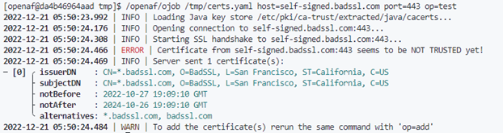
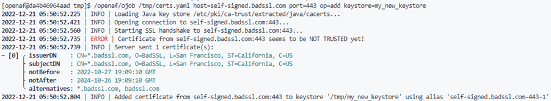
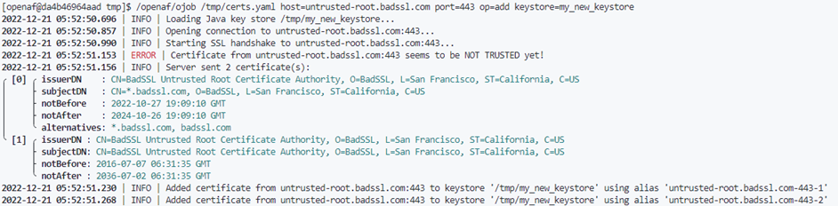
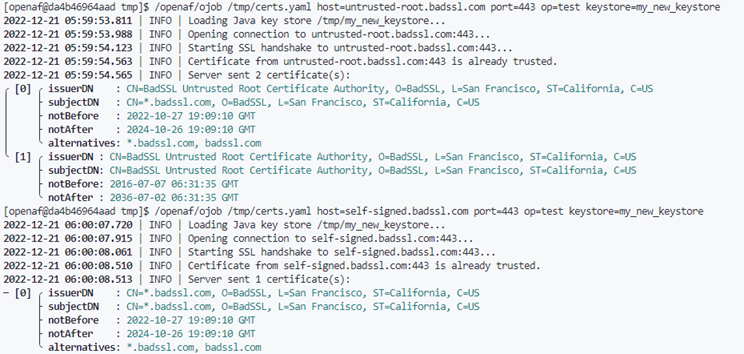
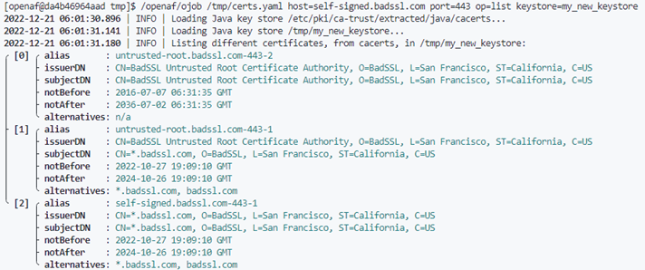

# Testing & adding SSL/TLS certificates to a Java keystore

When connecting to HTTPs endpoints using a self-signed or custom certificate with Java based applications (like OpenAF) it becomes necessary to test & validate the access to the corresponding endpoint and, if necessary, to add a CA certificate to the corresponding Java keystore.

To do this you can use: ojob.io/java/certs.

You can either use it directly if you have Internet access:

````
$ ojob ojob.io/java/certs [...]
````

OR download it to use it in an offline environment:

````
$ curl https://ojob.io/java/certs.yaml -o certs.yaml
$ ojob certs.yaml [...]
````

> Whenever ojob.io/java/certs is mentioned in the steps below you can replace it by "certs.yaml" if you will be executing it on a offline environment

## Testing the access to an endpoint

In the following example we try to access https://self-signed.badssl.com which, since it's https, means it's connecting on port 443:

````
$ ojob ojob.io/java/certs host=self-signed.badssl.com port=443 op=test
````



## Adding a customer CA/certificate

In the previous example we found that the certificate at self-signed.badssl.com:443 is not trusted. In the end it's suggested to run the same command with _op=add_ instead of _op=test_.

### If you need a keystore file

You might need to generate a keystore file to add, for example, to a containter. For that execute:

````
$ ojob ojob.io/java/certs host=self-signed.badssl.com port=443 op=add keystore=my_new_keystore
````



### If you need to include in the current Java installation

If you have the right permissions to change the _[java installation]/lib/security/cacerts_ file you can execute:

````
$ ojob ojob.io/java/certs host=self-signed.badssl.com port=443 op=add
````

### Adding more that one host/port

If you need to add more hosts and ports just repeat the command changing the host and port. If a keystore is provided it will update it, otherwise the current java installation will be updated if you have the right permissions.



## Retesting

To ensure that either you created the correct Java keystore or that you correctly add the certificates on the current java installation you can repeat again _op=test_:



## Listing custom certificates

To list the added custom certificates you can use _op=list_:

````
$ ojob ojob.io/java/certs keystore=my_new_keystore op=list
````

