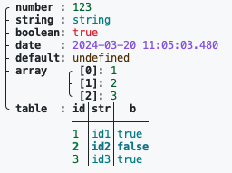
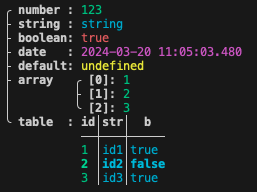
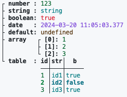
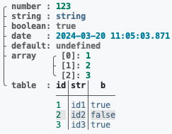
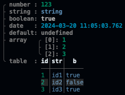
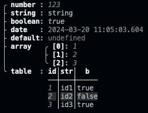

# How to - Change color formats

Starting on versions >= 20240318 it's possible to change the colors used by the OpenAF console and functions such as _printTree_, _printMap_, _printTable_ and similar effectively changing out OpenAF outputs look like.

This is controlled by the internal global variable **__colorFormat**. The default values are choosen to work with the majority of terminals and both light and dark backgrounds:

| light | dark |
|---|---|
|  |  |

On terminals that support 256 colors (or more) it's possible to have other color formats. You can change the values directly on the **__colorFormat** variable or use the ojob ```ojob ojob.io/oaf/colorFormats``` to change to predefined "themes":

| theme | ojob command | output |
|-------|--------------|--------|
| **basic** (with rectangular borders) | ```ojob ojob.io/oaf/colorFormats op=set theme=basic``` |  |
| **default** (the original) | ```ojob ojob.io/oaf/colorFormats op=unset``` |  |
| **thin-light** | ```ojob ojob.io/oaf/colorFormats op=set theme=thin-light``` |  |
| **thin-light-bold** | ```ojob ojob.io/oaf/colorFormats op=set theme=thin-light-bold``` |  |
| **thin** | ```ojob ojob.io/oaf/colorFormats op=set theme=thin``` |  |
| **thin-bold** | ```ojob ojob.io/oaf/colorFormats op=set theme=thin-bold``` |  |
| **mono2** | ```ojob ojob.io/oaf/colorFormats op=set theme=mono2``` |  |

You can explore these and other themes by executing: 

```bash
ojob ojob.io/oaf/colorFormats op=list
```

On the provided list there is also the necessary value change to the **__colorFormat** global variable for each theme. You can, of course, customize it to what suits your needs and eyes.

> This is a per user setting stored in $HOME/.openaf_profile or $OAF_HOME/.openaf_profile.