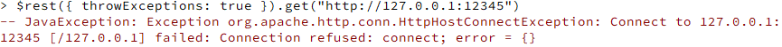
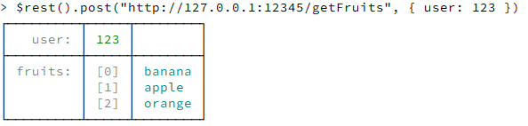
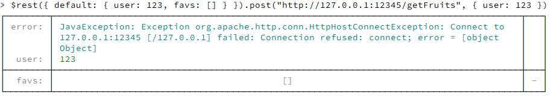

# Handling failure on REST calls

When calling other services through REST you always need to antecipate failure. It might be a network issue or the failure might be due to the service being down.

## The default behaviour

In OpenAF when making a REST call if it fails it will look similar to this:

````javascript
var res = $rest().get("http://127.0.0.1:12345");
if (isDef(res.error)) {
    logErr("There was an error contacting the service: " + res.error);
} else {
    // Process the result
}
````


Nevertheless you can add the _throwExceptions_ flag so you can handle it differently:

````javascript
try {
    var res = $rest({ 
        throwExceptions: true
    })
    .get("http://127.0.0.1:12345");

    // Process the result
} catch(e) {
    logErr("There was an error contacting the service: " + String(e));
}
````



## Another simpler, more elegant, way

But your code starts getting full of exception handling and you just wanted a non-critical information for which a default reply it's okay. Let's say you have a service that returns an array of favourite fruits given a user.

The expected behaviour when everything is working would be:



So your code could look like this:

````javascript
addFavouriteFruitsToDashboard(
    $rest()
    .post("http://127.0.0.1:12345/getFruits", { user: currentUser })
);
````

The only problem is if the service fails. Then you will have to either check the result or try/catch the function _addFavouriteFruitsToDashboard_ call. But the _$rest()_ shortcut can handle that for you with the option _default_. This option let's you define a default map in case something goes wrong. You still get the _error_ entry but you can choose to handle it or note. 

The previous code now can look more like this:

````javascript
addFavouriteFruitsToDashboard(
    $rest({
        default: { 
            user  : currentUser, 
            fruits: []
        }
    })
    .post("http://127.0.0.1:12345/getFruits", { user: currentUser })
);
````

So in case of error, you will always have, at least, an empty _fruits_ array. Because calling the _$rest()_function now with an error on the server (like turning it off) results in:



## By the way&#46;&#46;&#46;

By the way, if you want to test it yourself and need a quick dirty rest service you just have to run the following lines:

````javascript
ow.loadServer();

var hs = ow.server.httpd.start(12345);
ow.server.httpd.route(hs, { 
    "/getFruits": r => {
        return ow.server.rest.reply("/getFruits", r, 
            (idxs, data, req) => { 
                return { 
                    user: data.user, 
                    fruits: [ 
                        'banana', 
                        'apple', 
                        'orange' 
                    ] 
                } 
            }
        )
    }
});

log("I'm ready!");
ow.server.daemon();
````