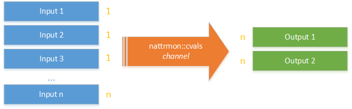

# Using buffers in nAttrMon

If you have a large number of nAttrMon inputs and probably a smaller number of outputs the probability of having sets of inputs that all run at the same time is high.

There is no problem in this as nAttrMon will handle each input execution in parallel but you might find, by debugging nAttrMon, that your outputs and/or validations might be "overwhelmed".

The symptoms are usually big spikes on cpu usage (when all inputs start) and an overall delay of execution of plugs (plugs that should execute afterwards take longer than expected to start).



So if you have _n_ inputs and all of them change attributes you will have _n_ changes to __nattrmon::cvals__. If your outputs subscribe __nattrmon::cvals__ changes each of those outputs will be triggered also _n_ times to process each change. Of course the larger number of inputs the more threads will be executing in parallel.

This is usually the reason for larger than expected cpu usage spikes and delay of execution of other plugs because nAttrMon is busy executing outputs.

The same applies between inputs & validations and validations & outputs where the __nattrmon::warnings__ channel is also used.

So what can be done to aliviate the load on outputs and validations?

## nAttrMon buffers

The answer is buffering changes to __nattrmon::cvals__ and __nattrmon::warnings__. 

OpenAF provides a special channel type called _'buffer'_. This channel implementation can receive a set of operations (e.g. set, setall, unset, unsetall) from a source channel and only trigger those operations, as batch operations (e.g. setall and unsetall), on a target channel on two conditions: maximum time after the first operation was buffered and maximum number of operations buffered.

The end result in nAttrMon is a single output execution for _n_ inputs/validations executed at the same time and a single validation execution for _n_inputs executed at the same time. This solves part of the cpu usage spikes and potential delays on other plug executions when dealing with multiple simultaneous (or near simultaneous) inputs or validations.

## What needs to be changed to use nAttrMon buffers

First activate the following flags on the nattrmon.yaml configuration file (based on the provided nattrmon.yaml.sample):

````yaml
BUFFERCHANNELS: true
BUFFERBYNUMBER: 100
BUFFERBYTIME  : 1000
````

This creates two new channels: __nattrmon::cvals::buffer__ and __nattrmon::warnings::buffer__. These channels will only change after __nattrmon::cvals__ and __nattrmon::warnings__ have 100 changes or more than 1000ms passed since the first change not reflected on the buffer channels.

### Inputs

The inputs will continue to use internally __nattrmon::cvals__. So no changes are needed on inputs.

### Validations

The validations can now use the __nattrmon::cvals::buffer__ since they will also benefit from the buffering as the outputs do:

````yaml
validation:
   name            : Set of generic validations
   chSubscribe     : nattrmon::cvals::buffer
   waitForFinish   : false
   killAfterMinutes: 5
   execFrom        : nValidation_Generic
   execArgs        :
   [...]
````

_Note: you can use __killAfterMinutes__ in any plug to ensure that if it goes over a specific amount of minutes nAttrMon will terminate the execution of that plug as a sanity measure. Use with care._

__Note for custom validations: _your validation should be able to handle a single change (args.op == "set") or an array of changes (args.op == "setall")_.__

### Outputs

The outputs can now use the nattrmon::cvals::buffer and nattrmon::warnings::buffer:

````yaml
output:
    name         : Output Warnings by email
    chSubscribe  : nattrmon::warnings::buffer
    waitForFinish: false
    onlyOnEvent  : false
    [...]
````

````yaml
output:
    name          : Output ES values
    chSubscribe   : nattrmon::cvals::buffer
    considerSetAll: true
    waitForFinish : true
    onlyOnEvent   : true
````

__Note for custom outputs: _your output should be able to handle a single change (args.op == "set") or an array of changes (args.op == "setall")_.__