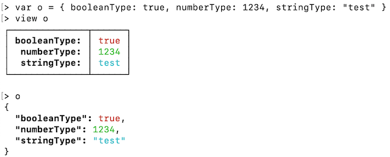
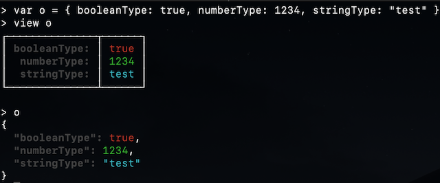
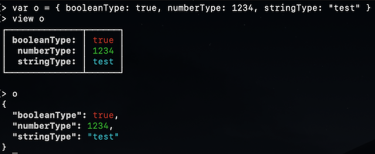
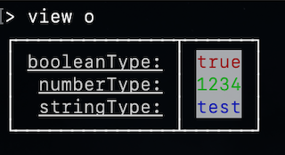

# OpenAF-console color formatting

When using the OpenAF-console if the terminal is ANSI capable some of the output will be "colored" to improve readability:



But the same on dark mode might be harder to read:



The current colors used in the OpenAF are defined in the internal variable "__colorFormat":

````javascript
> __colorFormat
{
  "key": "BOLD,BLACK",
  "number": "GREEN",
  "string": "CYAN",
  "boolean": "RED",
  "default": "YELLOW"
}
````

You can check all the available attributes & colors executing "help ansiColor". You can change any color directly on the __colorFormat map. If you want to make your changes permanent you can add them to the ~/.openaf-console_profile file.

So let's change and see the diference:

````javascript
> __colorFormat.key = "BOLD,WHITE"
````



Much easier to read. Of course, it all depends on your personal preferences:

````javascript
{
  "key": "UNDERLINE,WHITE",
  "number": "BG_WHITE,GREEN",
  "string": "BG_WHITE,BLUE",
  "boolean": "BG_WHITE,RED",
  "default": "BG_WHITE,YELLOW"
}
````

